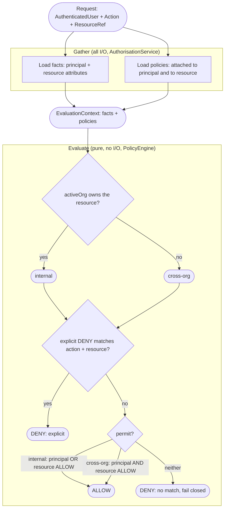
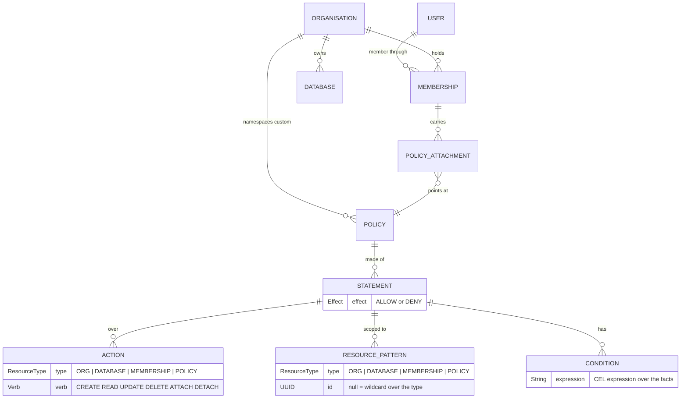

# aminam

[](https://github.com/lloydmeta/aminam/actions/workflows/ci.yaml)

Authentication Management & Access Management : aminam.

An IAM exploration that has user signup, JWT authentication, and an attribute-based,
fine-grained authorisation engine over organisations and the databases they own.

**NOT** production ready: this is a personal scratchpad project.

## Goal

Model a world where a user can belong to many organisations at once, each organisation owns some
resources (here, databases), and what a user may do to a resource depends on the policies that
apply to them in that organisation.

The main showcase is the authorisation engine: ABAC at its core, shipping with built-in RBAC like
system roles scoped to an organisation (manager, admin, viewer) while allowing organisations to 
define their own custom, fine-grained policies on top.

## What it has/does

* Authentication: signup, login, logout, and `/me`. Login issues a short-lived JWT that works
  as a bearer token or as a cookie; logout revokes it.
* Organisations and membership: create organisations, add and remove members, and switch the
  active organisation for the current session.
* Databases as the main authz-governed resource: create, read, update, and delete; read DTOs
  carry an `editable` flag so a caller can be shown a resource is read-only.
* Policies: built-in system roles that mimic traditional RBAC roles, plus user-definable
  custom, org-scoped+owned policies with optional [CEL](https://celbyexample.com) condition
  expressions, which allow flexible fine-grained control (e.g. creator-managed databases).
* Permissions are managed by policy id: A manager attaches either a system role or a custom
  policy their organisation defined to org members.
* Fails closed: an unauthorised caller gets a 403, and a resource they cannot see returns a 404
  rather than confirming it exists.
* [OpenAPI/Swagger spec](./api/openapi.yaml), Swagger UI at [/q/swagger-ui](http://localhost:8080/q/swagger-ui/) when
  running Quarkus Dev mode (more below).

## Design

Highlights:

* ABAC authorisation inspired by [AWS IAM policy evaluation](https://docs.aws.amazon.com/IAM/latest/UserGuide/reference_policies_evaluation-logic-cross-account.html):
  every policy is evaluated, an explicit DENY beats any ALLOW, and nothing matching means DENY.
* Strongly typed identifiers, domain models, and errors, with a clean domain / infra / app
  layering so each layer is testable in isolation.

### Authorisation engine

The decision splits cleanly into IO vs evaluation phases:
* Gather: loads the facts (attributes of the acting principal and of the target resource) and
  the policies that apply to each, then hands over an immutable evaluation context.
* Evaluate: picks a regime from whether the principal's active organisation owns the resource:
  "internal" access permits when either the principal's policies or the resource's policies allow;
  "cross-org" access requires both sides to allow. An explicit DENY anywhere wins, and no match
  fails closed.



### Domain model

A policy covers both the built-in system roles (viewer, admin, manager), which have no database
row and are evaluated in code, and custom policies, which an organisation owns and which are
stored.

A membership carries policy attachments; each policy is a set of statements, and each
statement has an effect (ALLOW or DENY), a set of actions (a resource type paired with a verb),
and the resource patterns it targets (a resource type plus an optional id, where a null id is a
wildcard over that type).  It may also optionally have a condition.



## Running it

### Prerequisites

* Docker (Dev Services uses it for dev and test)
* Java 25
* openssl (only to provision non-ephemeral JWT keys)

### Dev

```sh
make dev
```

Runs `./gradlew quarkusDev`; Dev Services start Postgres and Redis. No key setup is needed: when
no JWT key locations are configured the app generates an ephemeral RSA keypair at startup and logs
a warning. Then open [Swagger UI](http://localhost:8080/q/swagger-ui).

### Test

```sh
make test
```

### Full stack (Docker)

```sh
make keys build up
```

Generates a real RSA keypair into `./keys`, builds the JVM image, and starts Postgres, Redis, and
the app via Docker Compose. The service listens on 8080; the keys are mounted at `/keys`.

Configuration (override via environment, for example an `.env` file read by Docker Compose):

* `POSTGRES_PASSWORD`: Postgres password (default `aminam-dev`).
* `AMINAM_JWT_PRIVATE_KEY_LOCATION` and `AMINAM_JWT_PUBLIC_KEY_LOCATION`: PEM paths (default
  `/keys/jwt-private.pem` and `/keys/jwt-public.pem` in the container).

`make down` stops the stack and removes volumes. `make help` lists the available tasks.
